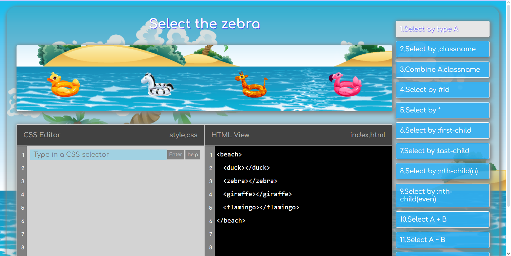

# CSS Selectors Game

Welcome to the **CSS Selectors** – an interactive way to learn and practice the rules of writing CSS selectors!

***************************

## About poject ##

This project is designed to help users learn and master CSS selectors through a fun, interactive game. Users will be challenged to select elements based on specific CSS rules. By completing levels, users gain a deeper understanding of how CSS selectors work in real-world scenarios.

***************************

## Deploy ##

* [https://massaracsh7.github.io/css-selectors/](https://massaracsh7.github.io/css-selectors/)

***************************

## Stack ##

- **TypeScript**: Provides static typing and enhances code quality.
- **Webpack**: Bundles all resources, including JavaScript, SCSS, and assets.
- **SCSS**: Used for styling the project with enhanced CSS features.
- **Jest**: A testing framework used to write and run unit tests for the project.

***************************

## Features ##

- Interactive game that progressively teaches CSS selectors.
- Multiple levels with increasing difficulty.
- Live feedback on user selections.
- Responsive design, works on both desktop and mobile.
- Test coverage for core logic using Jest.
- Modular SCSS structure for maintainable and reusable styles.

***************************

## Setting up ##

* Clone this repo: $ git clone https://github.com/massaracsh7/css-selectors.git

* Go to downloaded folder: $ cd css-selectors.

* Install dependencies: $ npm install

* Runs the app in the development mode $ npm run dev

* Open http://localhost:8080 to view it in the browser.

* The page will reload if you make edits. You will also see any lint errors in the console.

***************************

## Usage ## 

Once the development server is running, open the game in your browser and start learning CSS selectors. Each level will present an HTML structure, and you’ll be tasked with selecting elements using valid CSS selectors. As you progress, the levels will get more challenging!

***************************

## Available scripts ##

* **npm run build**
Script to build the app for production to the build folder.
Your app is ready to be deployed!

* **npm run dev**
Starts the development server with Webpack.

* **npm run test**
Script to launch the test runner in the interactive watch mode.
See the section about running tests for more information.

* **npm run deploy**
Deploys the dist folder to GitHub Pages using gh-pages

* **npm run lint**
 Runs ESLint on the src folder to check for coding style issues.
 You will see any lint errors in the console.
